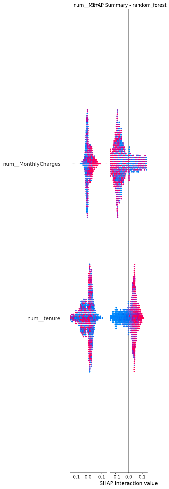
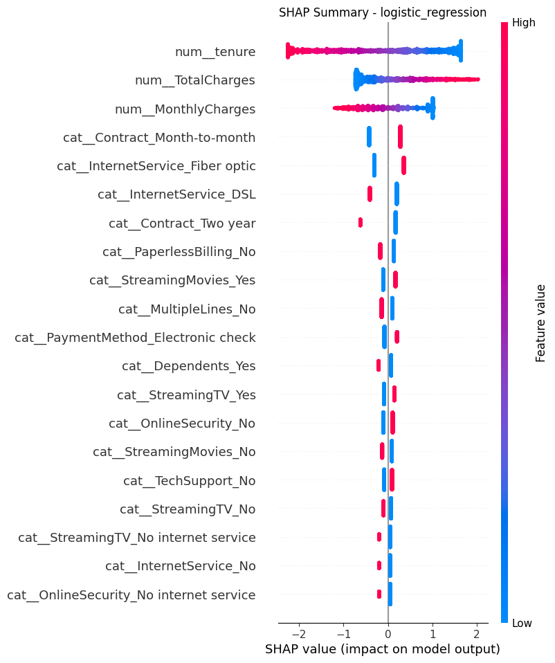

# 📉 Telco Customer Churn Prediction & Retention Strategy System  
**End-to-End Machine Learning • Profit Optimization • Explainability • Streamlit App**

This project goes beyond traditional churn prediction.  
It combines **machine learning**, **business economics**, and **explainability** to create a full **decision-support system** used for **real retention strategy**.

Built with:
- **Python**, scikit-learn, SMOTE, SHAP  
- **Streamlit** for a real-time interactive app  
- **Joblib** for production-ready model saving/loading  

---

## 🚀 Project Objectives

### 🔍 1. Predict Customer Churn  
Train ML models to identify customers likely to leave.

### 💰 2. Optimize for Profit, Not Accuracy  
Use a cost-based profit curve to determine the **optimal decision threshold**, considering:
- Cost of losing a customer  
- Cost of retention offers  

### 🧠 3. Explain *why* customers churn  
Use **global and local SHAP explanations** to identify key risk drivers.

### 🎯 4. Recommend Who to Target  
Generate a prioritized retention list under a fixed budget.

### 🖥️ 5. Provide an Interactive Application  
A Streamlit app that:
- predicts churn  
- estimates financial impact  
- classifies risk  
- recommends retention actions  

---

## 🏗️ Project Architecture

```

Telco-Customer-Churn/
│
├── app/
│   └── app.py                     # Streamlit app
│
├── data/
│   └── Telco-Customer-Churn.csv
│
├── models/
│   ├── rf_churn_pipeline.joblib   # Saved Random Forest pipeline
│   └── config.json                # Threshold + cost settings
│
├── reports/
│   ├── shap_summary_logistic_regression.png
│   └── shap_summary_random_forest.png
│
├── src/
│   ├── data_prep.py               # Cleaning + loading
│   ├── features.py                # Feature engineering
│   ├── modeling.py                # Model pipelines
│   ├── evaluation.py              # Metrics + ROC
│   ├── profit.py                  # Profit curve thresholding
│   ├── retention.py               # Targeting engine
│   ├── explainability.py          # Global + local SHAP
│   └── model_io.py                # Saving & loading model
│
└── main.py                        # End-to-end training script

```

---

# 📊 Key Results

## 🔮 Model Performance  
**Random Forest (with SMOTE)**  
- Accuracy: **0.774**  
- Recall (churn class): **0.631**  
- ROC-AUC: **0.832**

---

## 💰 Profit Optimization

Assumptions:
- Loss if customer churns: **$200**  
- Cost of retention offer: **$20**  

The optimal threshold selected using the profit curve:

```

Best threshold: 0.06
Max profit: $50,060

```

👉 **Profit-aware modeling encourages aggressive retention**, because the cost of a false negative (losing a customer) is much higher than the cost of a false positive (offering a discount).

---

# 🧠 SHAP Explainability

## 🔼 Global Feature Importance  
Key drivers of churn:

- **High MonthlyCharges** → churn ↑  
- **Low tenure** → churn ↑  
- **Month-to-month contract** → churn ↑  
- **Lack of services** (OnlineSecurity, TechSupport) → churn ↑  

Screenshots:





---

## 🔍 Local Explanation (Example Customer)

For customer **`5542-TBBWB`**:

| Feature            | SHAP Impact | Interpretation               |
|--------------------|-------------|------------------------------|
| MonthlyCharges     | +0.129      | Increases churn risk         |
| tenure             | −0.129      | Decreases churn risk         |

**Interpretation:**  
> The customer has been loyal for a long time, but their monthly bill is high.  
> Perfect case for a **loyalty discount or plan optimization**.

---

# 💸 Retention Targeting Engine

Given:
- Budget: **$20,000**
- Cost per retention offer: **$20**

You can target **1,000 high-risk customers**.

Example output:

```

customerID    p_churn   expected_loss
5542-TBBWB    0.987     $197.41
9804-ICWBG    0.987     $197.41
8375-DKEBR    0.986     $197.36
...

````

This ensures retention spending delivers **maximum revenue protection**.

---

# 🖥️ Streamlit App (Interactive Tool)

The app allows:
- entering a customer's attributes  
- predicting churn probability  
- viewing risk level (color-coded)  
- estimating expected revenue loss  
- recommending retention actions  

### Run the app:

```bash
streamlit run app/app.py
````

Example output:

```
Churn probability: 0.188  
Risk level: HIGH  
Expected loss if no action: $37.66  
Expected gain if targeted with a $20 offer: $17.66  
Recommendation: PRIORITY RETENTION  
```

---

# 🛠️ How It Works (Simple Explanation)

1. The model learns patterns from past churners.
2. It predicts how likely a new customer is to leave.
3. A **profit curve** converts probability into a decision threshold.
4. **Expected loss** and **expected gain** are computed for each customer.
5. A **targeting engine** selects the best customers to save under budget.
6. **SHAP explains why** each prediction was made.
7. A **Streamlit app** makes the whole system easy to use.

---

# 📦 Installation

```bash
pip install -r requirements.txt
python main.py
streamlit run app/app.py
```

---

# ⭐ Why This Project Is Unique

Most churn projects stop at simple prediction.
This project includes **everything a real business needs**:

✔ Profit-based modeling
✔ Budget-constrained retention engine
✔ Global + local SHAP explainability
✔ Fully modular ML pipeline
✔ Saved model for production
✔ Interactive Streamlit interface
✔ Business narrative & real-world applicability

This is the kind of end-to-end solution used by telecom, banking, and subscription companies.

---

# 💡 Future Enhancements

* Add Customer Lifetime Value (CLV) modeling
* Deploy app on Streamlit Cloud
* Add uplift modeling (true treatment impact)
* Build a REST API for production deployment
* Add Waterfall SHAP plots for single-customer explanation

---

# 👤 Author

**Anirudh Hegde**
Data Science & ML | Analytics Engineering | MLOps

* GitHub: [https://github.com/AnirudhHegde20](https://github.com/AnirudhHegde20)
* LinkedIn: [https://linkedin.com/in/anirudhhegde1997](https://linkedin.com/in/anirudhhegde1997)
```
